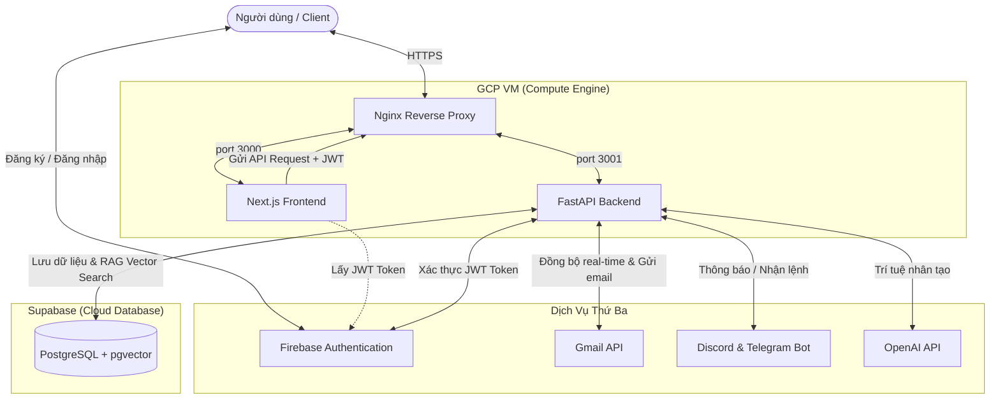

# AI Email Manager SaaS 🚀

AI Email Manager là nền tảng SaaS hiện đại giúp người dùng quản lý Gmail bằng trí tuệ nhân tạo (AI). Dự án được thiết kế chuyên nghiệp, bảo mật cao và tối ưu hóa tính năng thông báo thời gian thực qua Discord và Telegram.

---

## 🛠️ Công Nghệ Sử Dụng (Tech Stack)

### Frontend
* **Next.js 14 & React 18**: Framework hiện đại với App Router.
* **TypeScript**: Rõ ràng, chặt chẽ, hạn chế tối đa lỗi runtime.
* **TailwindCSS**: Thiết kế responsive với Dark/Light mode.
* **Axios + Interceptors**: Gọi API với JWT tự động đính kèm mọi request.
* **Framer Motion**: Animations mượt mà.

### Backend



---

## ✨ Các Tính Năng Nổi Bật (Key Features)

1. **Hòm Thư Tập Trung Thông Minh (Smart Inbox)**: Xem danh sách email với thông tin phân loại danh mục (Work, Promotion, Security, Spam...), độ khẩn cấp (Low, Medium, High) và bản tóm tắt ngắn do AI tự động biên soạn.
2. **AI RAG Chat (Hỏi Đáp Email)**: Trò chuyện tự nhiên với trợ lý AI về nội dung hòm thư cá nhân của bạn. AI tự động truy xuất các email liên quan bằng công nghệ so khớp Vector (pgvector) để đưa ra câu trả lời kèm trích dẫn nguồn (Sources) cụ thể.
3. **Gmail Sync Service**: Đồng bộ thư mới theo thời gian thực sử dụng giải pháp **Google Watch API (Gmail Webhook)** kết hợp Google Pub/Sub.
4. **AI Draft & Reply Email**: Tự động sinh nội dung thư nháp hoặc thư trả lời (chuyên nghiệp, thân thiện, ngắn gọn) dựa trên yêu cầu và lưu trực tiếp vào mục Draft của Gmail.
5. **Đa Kênh Thông Báo (Omnichannel Notifications)**:
   * **Discord**: Nhận tin nhắn thông báo tóm tắt email khẩn cấp, email mới gửi qua Webhook hoặc Bot Channel.
   * **Telegram**: Liên kết tài khoản qua mã token bảo mật và nhận tin nhắn thông báo trực tiếp qua Telegram Bot.

---

## 🔒 Các Giải Pháp Bảo Mật Được Áp Dụng (Security Implementations)

* **SQL Injection Prevention**: Sử dụng ORM SQLAlchemy cùng Parameterized Queries, loại bỏ hoàn toàn nguy cơ chèn mã SQL độc hại.
* **XSS Prevention (Cross-Site Scripting)**: Next.js mặc định bảo vệ XSS mức giao diện. Backend sử dụng các Header bảo mật (`Content-Security-Policy`, `X-XSS-Protection`, `X-Content-Type-Options`).
* **Clickjacking Protection**: Cấu hình `X-Frame-Options: DENY` ngăn chặn trang web bị nhúng trái phép vào các trang độc hại.
* **Secure Token Auth**: Xác thực người dùng bằng Firebase JWT ID Token kết hợp kiểm tra chữ ký ở Backend (không lưu mật khẩu dạng plaintext).
* **HTTPS Enforcement (HSTS)**: Ép buộc tất cả các kết nối phải đi qua giao thức bảo mật HTTPS an toàn thông qua chứng chỉ Let's Encrypt SSL.

---

## 🚀 Hướng Dẫn Cài Đặt Trên Google Cloud VM

### Bước 1: Clone dự án và cài đặt môi trường
```bash
git clone <URL_KHO_CODE>
cd ai-email-manager-agent
```

### Bước 2: Triển khai Backend (FastAPI)
```bash
cd backend
python3 -m venv venv
source venv/bin/activate
pip install -r requirements.txt
# Copy file .env chứa API Keys thực tế của bạn vào thư mục này
nohup python run.py > backend.log 2>&1 &
```

### Bước 3: Triển khai Frontend (Next.js)
```bash
cd ../frontend
# Cấu hình biến NEXT_PUBLIC_API_URL=https://api.emailkhanh.freeddns.org vào file .env
npm install --legacy-peer-deps
npm run build
nohup npm run start > frontend.log 2>&1 &
```

### Bước 4: Cấu hình Nginx & SSL
Copy cấu hình `nginx.conf` vào `/etc/nginx/sites-available/default` và chạy lệnh cấp SSL:
```bash
sudo certbot --nginx -d emailkhanh.freeddns.org -d api.emailkhanh.freeddns.org --force-renewal
```
